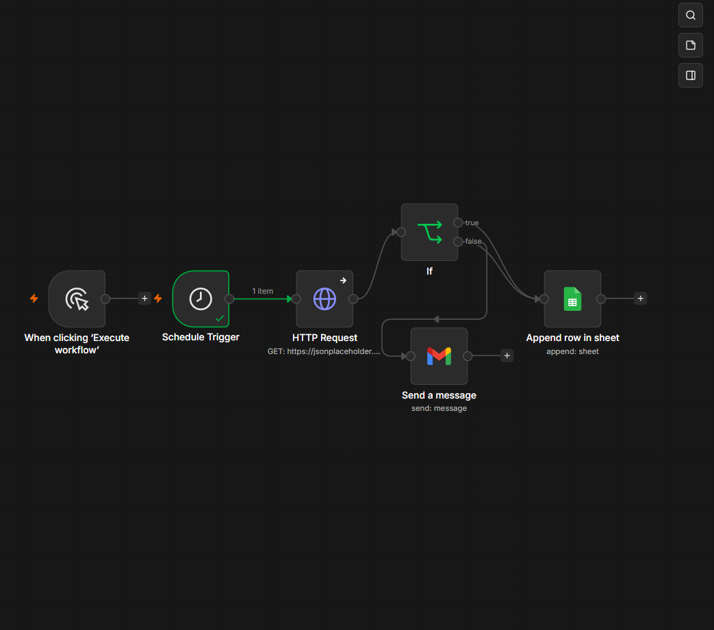

# automated-api-monitoring-n8n
# Automated API Health Check & Alerting System

A production-ready automated API monitoring and logging workflow built using **n8n**. This project demonstrates an engineering approach to synthetic backend monitoring, automated response validation, database logging, and incident alerting.

## 🛠️ Tech Stack & Integrations
* **Automation Engine:** n8n (Low-code/Node-based execution)
* **Testing Protocol:** REST API (HTTP Request validation)
* **Data Logging:** Google Sheets API (OAuth 2.0 integration)
* **Alerting System:** Gmail API (Automated incident notification)
* **Test Environment:** JSONPlaceholder (Public Mock API Server used for isolating and mimicking production responses)

## 📐 Workflow Architecture

The workflow consists of the following architectural components:
1. **Schedule Trigger:** Initiates automated polling intervals (configured for 1-minute intervals for real-time validation) to ensure continuous monitoring.
2. **HTTP Request Node:** Performs automated synthetic requests against the target API endpoint, capturing the full response payload, status codes, and network metadata.
3. **Conditional Logic (If Node):** Dynamically parses response attributes. It verifies if the `statusCode` strictly equals `200`.
   * **True Branch (Success):** Automatically parses dynamic JSON attributes (`title`, `body`) and appends operational logs to a centralized Google Sheets spreadsheet for further QA stability metrics analysis.
   * **False Branch (Failure):** Triggers an immediate high-priority incident alert via Gmail/SMTP containing real-time failure diagnostics to achieve minimal Time to Detect (TTD).

## 🚀 How to Deploy This Project

1. Install and run **n8n** locally or on your cloud instance.
2. Create a new empty workflow.
3. Import the `api-monitoring-workflow.json` file from this repository (or copy the JSON content and press `Ctrl+V` directly on the n8n canvas).
4. Configure your Google Cloud Console App credentials (OAuth2) for the **Google Sheets** and **Gmail** nodes.
5. Set your target API endpoint in the **HTTP Request** node and activate the workflow.
